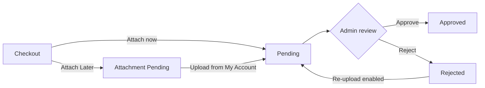

# Attach Later &amp; Re‑Upload

Two settings make the prescription flow friendlier for customers: letting them **upload after** placing the order, and letting them **try again** if an upload is rejected. Both are enabled on the [General Settings](https://wpdoc.webkul.com/medical-prescription/documentation/configuration-general.html) tab.

---

## Attach Later

**What it does:** lets **logged‑in** customers place a gated order *without* attaching a prescription first, then upload it later from **My Account**.

### How it works

1. At checkout, a logged‑in customer chooses the *attach later* option instead of uploading immediately.
2. The order is placed and held with the **Attachment Pending** status (the order is set to *on‑hold*).
3. The customer returns to **My Account → My Prescriptions** (or the order's view page) and uploads the file when they have it.
4. The prescription moves to **Pending**, and your team reviews it as normal.

### When to use it

- Customers who are still waiting on their doctor's script but want to reserve stock or lock in a price.
- Repeat customers you trust to follow up.

::: warning Logged‑in only
Attach Later is only available to logged‑in customers, because the follow‑up upload happens in their account. Guests must attach at checkout.
:::

::: tip Keep control
Even with Attach Later, **no order is approved without a prescription** — it simply defers *when* the file is collected, not *whether*. The order stays on hold until a prescription is uploaded and approved.
:::

---

## Re‑Upload If Rejected

**What it does:** when an admin **rejects** a prescription, the customer can submit a **new** file instead of being stuck with a dead order.

### How it works

1. An admin reviews a prescription and sets it to **Rejected** (for example, wrong document, expired, or unreadable).
2. If **Enable Re‑Upload If Rejected** is on, the customer sees the rejected status and an option to upload again.
3. The customer attaches a fresh file; the prescription returns to **Pending** for another review.

### When to use it

- Almost always — it turns a rejection into a fix instead of a lost sale and a support ticket.
- Pair it with **customer email notifications** so the buyer knows immediately that they need to re‑upload. See [Notifications](https://wpdoc.webkul.com/medical-prescription/documentation/configuration-notifications.html).

---

## Putting it together

Both options are optional and independent — enable whichever fits your store. See the statuses they produce in [Prescription Statuses](https://wpdoc.webkul.com/medical-prescription/documentation/prescription-statuses.html).
