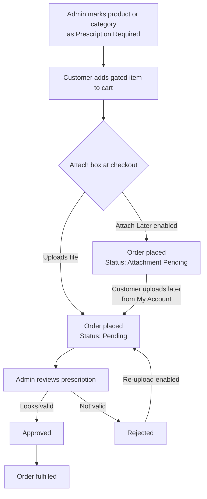

# How It Works

A quick tour of the end‑to‑end flow, from a gated product to a fulfilled order.

---

## The lifecycle of a prescription order

---

## Step by step

### 1. You decide what needs a prescription
Mark individual products, or select whole categories, as *prescription required*. Gated products show a customizable label on the storefront.

➡ [Product & Category Setup](https://wpdoc.webkul.com/medical-prescription/documentation/product-setup.html)

### 2. The customer shops normally
Freely purchasable items (masks, vitamins, devices) behave like any WooCommerce product. Gated items display the **Prescription Required** label wherever you've placed it.

### 3. The customer attaches a prescription
When a gated item is in the cart, an **Attach Prescription** box appears at the position you chose (product, cart, checkout, or order page). The customer drags in a file — JPG, PNG, PDF, or DOC/DOCX.

➡ [Uploading a Prescription](https://wpdoc.webkul.com/medical-prescription/documentation/customer-upload-flow.html)

### 4. Checkout is enforced
The order **cannot be placed** until a file is attached. The customer sees a reminder: *"Kindly upload the medical prescription first in order to place an order."*

If you've enabled **Attach Later**, logged‑in customers can skip this and upload from **My Account** afterwards; the order is held with an *Attachment Pending* status.

➡ [Attach Later & Re‑Upload](https://wpdoc.webkul.com/medical-prescription/documentation/attach-later-reupload.html)

### 5. Your team reviews it
Every prescription order appears on the admin **Orders** review desk. Staff open the upload, read it (optionally with OCR/AI assistance), and set it to **Approved** or **Rejected**.

➡ [Order Management](https://wpdoc.webkul.com/medical-prescription/documentation/admin-order-management.html)

### 6. Everyone is notified
Depending on your settings, the customer and admin receive emails, and each status change is logged as an order note.

➡ [Email Notifications](https://wpdoc.webkul.com/medical-prescription/documentation/email-notifications.html)

### 7. Rejections can be retried
If a prescription is rejected and **Re‑upload if rejected** is enabled, the customer can submit a fresh file, returning the order to *Pending* for another review.

---

## Where the pieces live

| Area | Who uses it | What it's for |
| --- | --- | --- |
| **Configuration** screen | Admin | Master switch, upload rules, labels, positions, emails, OCR/AI. |
| Product edit → **Prescription** meta | Admin | Mark one product as gated. |
| **Orders** review desk | Admin / staff | Read and approve/reject each prescription. |
| Product / cart / checkout **Attach box** | Customer | Upload the prescription. |
| **My Account → My Prescriptions** | Customer | Track submitted prescriptions and their status. |

---

## Prescription statuses in brief

| Status | Meaning |
| --- | --- |
| **Attachment Pending** | Order placed via *Attach Later*; no file uploaded yet. |
| **Pending** | File(s) uploaded, waiting for admin review. |
| **Approved** | Admin verified the prescription. |
| **Rejected** | Admin rejected it; customer may re‑upload if enabled. |

Full details in [Prescription Statuses](https://wpdoc.webkul.com/medical-prescription/documentation/prescription-statuses.html).
