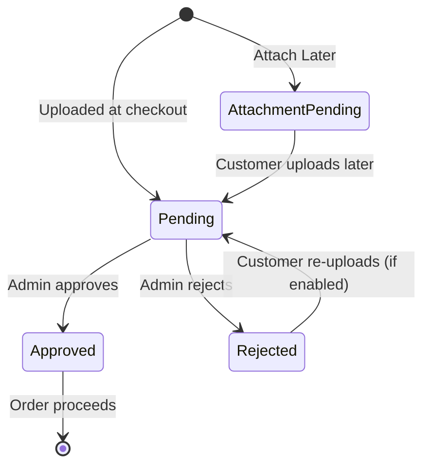

# Prescription Statuses

Every gated order carries a **prescription status** that's separate from the WooCommerce order status. It tells you exactly where the order sits in the review process.

---

## The four statuses

| Status | Badge | Meaning | Set when |
| --- | --- | --- | --- |
| **Attachment Pending** | `ATTACHMENT PENDING` | Order placed but no prescription uploaded yet. | Customer used [Attach Later](https://wpdoc.webkul.com/medical-prescription/documentation/attach-later-reupload.html); the order is held *on‑hold*. |
| **Pending** | `Pending` | Prescription uploaded, waiting for admin review. | Customer attaches file(s) at checkout, or uploads later from My Account. |
| **Approved** | `Approved` | Admin verified the prescription. | Admin clicks **Approve**. |
| **Rejected** | `Rejected` | Admin rejected the prescription. | Admin clicks **Reject**. |

---

## How statuses flow

---

## What each status means for you

### Attachment Pending
The customer committed to the order but hasn't provided the prescription. The order is **on hold** — don't fulfil it. It becomes **Pending** the moment they upload from their account. Only appears when [Attach Later](https://wpdoc.webkul.com/medical-prescription/documentation/attach-later-reupload.html) is enabled.

### Pending
Your action is needed. Open the order on the [review desk](https://wpdoc.webkul.com/medical-prescription/documentation/admin-order-management.html), read the prescription, and approve or reject it.

### Approved
The prescription is valid and the order can be fulfilled like any other WooCommerce order. If [customer emails](https://wpdoc.webkul.com/medical-prescription/documentation/configuration-notifications.html) are on, the buyer has been notified.

### Rejected
The prescription wasn't acceptable. If [re‑upload](https://wpdoc.webkul.com/medical-prescription/documentation/attach-later-reupload.html) is enabled, the customer can submit a new file (returning the order to **Pending**). Otherwise, follow up with the customer directly.

---

## Where statuses appear

- **Admin → Orders** review desk — filter and sort by prescription status.
- **Order detail** page — shown next to the prescription viewer.
- **Customer → My Account → My Prescriptions** — customers see their own statuses. See [My Prescriptions Vault](https://wpdoc.webkul.com/medical-prescription/documentation/my-prescriptions-vault.html).
- **Order notes** — each change is logged when [order notes](https://wpdoc.webkul.com/medical-prescription/documentation/configuration-general.html) are enabled.

---

## Status vs. WooCommerce order status

The **prescription status** is independent of the WooCommerce **order status** (Processing, On‑hold, Completed, etc.). A common pattern:

| Prescription status | Typical order status |
| --- | --- |
| Attachment Pending | On‑hold |
| Pending | On‑hold / Processing |
| Approved | Processing → Completed |
| Rejected | On‑hold (awaiting re‑upload) or Cancelled |

Use the prescription status to drive your fulfilment decision: **never ship an order whose prescription isn't Approved.**
